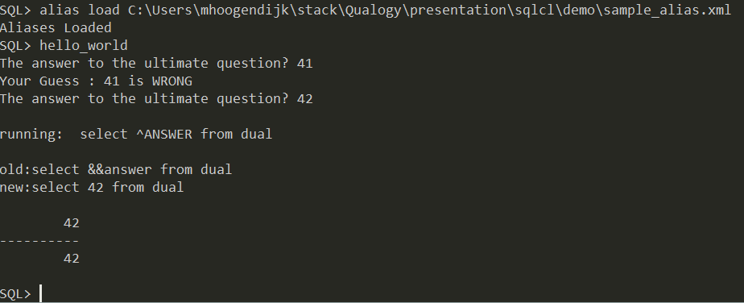

# The alias command
Purpose: make commonly used SQL statements available via an alias.

The alias command is persistent. This means when you start a new SQLcl session, it will load all your previously declared aliases.

Aliases are stored in your Application Data folder. For example:

`C:\Users\mhoogendijk\AppData\Roaming\sqlcl\aliases.xml`

## Create an alias

### Create an alias inline

The most basic alias is created with this statement:

`alias mytables=select table_name from user_tables where rownum < 4;`


Bind variables can be used too.

`alias mytables=select table_name from user_tables where lower(table_name) like '%' || :1 || '%';`


## import an alias
Purpose: Adding a new alias from an XML file

This allows you to add previously created aliases, maybe created by others.

alias load `<alias.xml>`

Example:
```xml
<?xml version="1.0" encoding="UTF-8"?>
<aliases xmlns:xsi="http://www.w3.org/2001/XMLSchema-instance"
	xsi:noNamespaceSchemaLocation="aliases.xsd">
	<alias name="hello_world">
		<description><![CDATA[An example for APEXCONN17]]></description>
		<queries> 
			<query>
				<sql><![CDATA[

script
  // turn on Substitutions manually
  // normally this is done when the accept /scan/ var/define commands are used
  ctx.setSubstitutionOn(true);
  var answer=null;

  // silly loop
  while(answer != '42' ) {
     // prompt and return the input.
     // last false flag is for hide for use with things like passwords not to echo
     answer = ctx.getPromptedFieldProvider().getPromptedField(ctx, 'The answer to the ultimate question?', false);
     if ( answer != '42' ) {
        ctx.write("Your Guess : " + answer + " is WRONG\n");
     }
     out.flush();
  }

// put the answer into the map of things to Substitution
ctx.getMap().put("ANSWER",answer);
/

prompt
prompt running:  select ^ANSWER from dual;
prompt

select &&answer from dual;

]]>
                    </sql>
            </query>
        </queries>		
    </alias>
</aliases>		
```

- [Source XML](../aliases/example_alias.xml)



# Tips

The alias command expects all bind variables are substituted. Therefore you should use the **custom command** approach when the number of arguments can differ.
