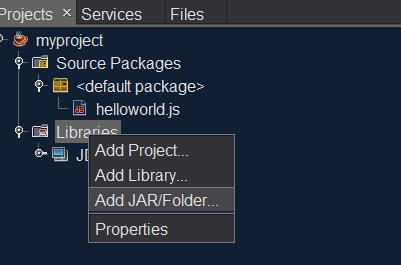

# Testing SQLcl scripts with Netbeans IDE 8.2

You can test SQLcl scripts with Netbeans without using the commandline tool.
This approach is much more efficient than reloading your script in SQLcl after you've made a change.

To run SQLcl scripts outside of SQLcl we do need create a database connection and make the same `globals` available as in SQLcl.

**Once your finished testing, remove the part to create the database connection from your script. SQLcl will take care of this
!**

## 

* [Requirements](#requirements)
* [Add SQLcl JAR files](#add-sqlcl-jar-files)
* [Test](#test)

## Requirements
Make sure you have created a new project as described here.

[Testing Nashorn scripts with Netbeans IDE 8.2](netbeans.md)

Download and extract SQLcl.

http://www.oracle.com/technetwork/developer-tools/sqlcl/downloads/index.html

## Add SQLcl JAR files
We need to add the SQLcl JAR files to our project.
Rightclick **Libraries** and select **Add JAR/Folder**.



Go to the folder where you unzipped SQLcl and select all JAR files.


## Test 
Add this line in your JavaScript file and replace the options with your database connection details:

**Please do not use a production database. You should always be careful when entering credentials like this!**
```javascript
loadWithNewGlobal(
    "https://raw.githubusercontent.com/mennooo/sqlcl/master/demos/test_for_netbeans.js", 
    {
        sid: "ORCL",
        host: "localhost",
        port: "1521",
        username: "hr",
        password: "hr"
    }
);
```

- [The test_for_netbeans.js script](../demos/4_netbeans/test_for_netbeans.js)

You should get a similar result when you run the script:

```
apr 02, 2017 11:25:45 PM oracle.dbtools.jdbc.util.LogUtil log
INFO: oracle.dbtools.jdbc.orest.Driver:<clinit>:27:No Message
apr 02, 2017 11:25:45 PM oracle.dbtools.jdbc.util.LogUtil log
INFO: oracle.dbtools.jdbc.orest.Driver:<clinit>:34::ORest driver loaded
Connecting to jdbc:oracle:thin:@localhost:1521:ORCL
The following query will be executed: select table_name from user_tables where rownum < 4;

TABLE_NAME                                                                      
--------------------------------------------------------------------------------
REGIONS
COUNTRIES
LOCATIONS

BUILD SUCCESSFUL (total time: 5 seconds)
```

## Create your own script for Netbeans

The purpose of the test script above was only to check if your Netbeans project is correct. The next step is to create your own script.

Let's look at contents of the demo script and run it locally.

```javascript
// A library to create a connection and return SQLcl globals
var connection = loadWithNewGlobal("https://raw.githubusercontent.com/mennooo/sqlcl/master/lib/connection.js");

// Set your connection details
var myConnection = connection.init({
    sid: "ORCL",
    host: "localhost",
    port: "1521",
    username: "hr",
    password: "hr"
});

/*
    The variable connection contains the three SQLcl global objects:
    - sqlcl
    - ctx
    - util
    
*/

// Let's run a Database Statement
myConnection.sqlcl.setStmt("select table_name from user_tables where rownum < 4;");
myConnection.sqlcl.run();
```

Running this one select statement was just the start. Now you're ready to learn all about the scripting possibilities with SQLcl.

To learn more about SQLcl scripting possibilities like interacting with the filesystem, changing the output stream and automating your tasks, take a look at this chapter:

- [The script command](./script.md)

## Changing a script for usage in SQLcl

For running scripts in SQLcl, you can remove the overhead to create a connection.

```javascript
// demo2.js
// load this script from SQLcl: script <your_script_name>

// Let's run a Database Statement
sqlcl.setStmt("select table_name from user_tables where rownum < 4;");
sqlcl.run();
```
