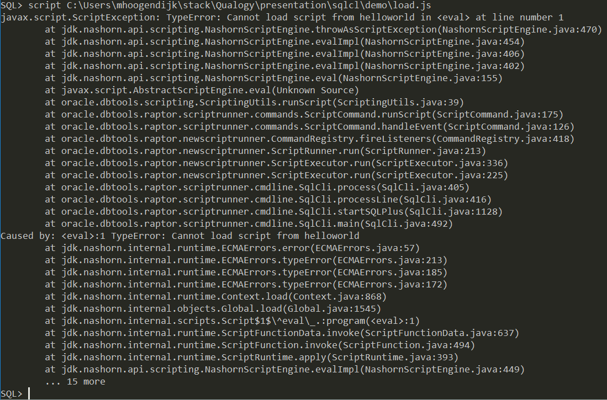

# The script command
Purpose: run JavaScript scripts in SQLcl.

For help in SQLcl type `help script`.

The scripts are runned immediately.

## Inline scripts
Although not very useful, it's the easiest way to execute a script.

1. Start SQLcl

`sql.exe /nolog`

2. Execute script

Type `script` and hit ENTER.

Type a script:
```
ctx.write('My first script\n');
/
```
Output:
```
SQL> script
  2  ctx.write('My first script\n');
  3  /
My first script
SQL>
```
## External scripts
Command: `script <script name>`

You can only run local scripts from your filesystem (and not via URL):

`script d:\scripts\helloworld.js`

Examples:
[https://github.com/oracle/oracle-db-tools/tree/master/sqlcl/examples](https://github.com/oracle/oracle-db-tools/tree/master/sqlcl/examples)

## Tips

### Loading scripts at startup

Scripts are non-persistent in SQLcl. This is a pity for custom commands.
But we load our custom commands if we execute our scripts at startup of SQLcl. You can do this by editing the login.sql.

```sql
SET sqlprompt "_user'@'_connect_identifier > "
SET sqlformat ansiconsole

-- Load script
cd D:\sqlcl\scripts
script helloworld.js
```

### Relative filepaths within the load function
It's (almost) not possible to load scripts using a relative filepath.

`script <script_dir>/load.js`

```javascript
//load.js

// Load a script in same directory as load.js
load("helloworld.js");
// Fails to load the script
```



The reason is that a script is loaded as a **string** and then evaluated as a function. The directory where SQLcl tries to find the file is the directory where you started SQLcl.

Example of script evaluation:
```javascript
eval('load("another-script.js");');
```

The context of these variables in a script are empty:
```javascript
print(__FILE__, __LINE__, __DIR__);
```

A workaround could be:

Change the current working directory to the location of the script

```
cd <script_dir>
script load.js
```

Now you can load the current directory into a variable in your script
```javascript
//load.js

// Java Class to get the current directory
var FileUtils = Java.type("oracle.dbtools.common.utils.FileUtils");

// Load directory into a variable
var cwd = FileUtils.getCWD(ctx);

load(cwd + '/helloworld.js');
```

### Changing the OutputStream
By default the output of a statement is written to the console/terminal. Sometimes you want to write the output to a file for instance.
If spooling a file is not sufficient, you have the option to change the OutputStream.

## Creating a custom command
SQLcl allows you to add custom commands. For instance this helloworld script:

```javascript
// helloworld.js

// SQLCL's Command Registry
var CommandRegistry = Java.type("oracle.dbtools.raptor.newscriptrunner.CommandRegistry");

// CommandListener for creating any new command
var CommandListener =  Java.type("oracle.dbtools.raptor.newscriptrunner.CommandListener")

// Broke the .js out from the Java.extend to be easier to read
var cmd = {};

// Called to attempt to handle any command
cmd.handle = function (conn,ctx,cmd) {
  if ( cmd.getSql().trim().startsWith("helloworld") ) {
   ctx.write("Hello world!\n");
   return true;
 }
   // return FALSE to indicate the command was not handled
   // and other commandListeners will be asked to handle it
   return false;
}

// fired before ANY command
cmd.begin = function (conn,ctx,cmd) {
}

// fired after ANY Command
cmd.end = function (conn,ctx,cmd) {
}

// Actual Extend of the Java CommandListener

var MyCmd2 = Java.extend(CommandListener, {
		handleEvent: cmd.handle ,
        beginEvent:  cmd.begin  ,
        endEvent:    cmd.end
});

// Registering the new Command
CommandRegistry.addForAllStmtsListener(MyCmd2.class);

```


A good example about how to create a script to add a custom command:
- [https://github.com/oracle/oracle-db-tools/blob/master/sqlcl/examples/customCommand.js](https://github.com/oracle/oracle-db-tools/blob/master/sqlcl/examples/customCommand.js)
